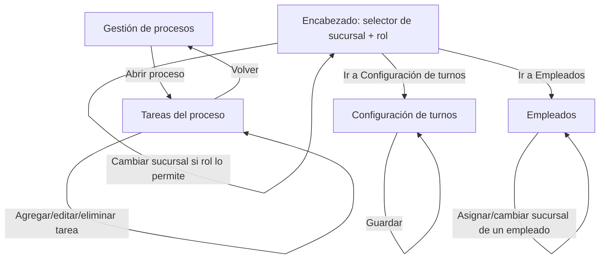

# hucheck — Plan

## Objective

Incorporar 4 pedidos del cliente sobre la base ya construida (procesos, cumplimiento, encargado, sucursales y reportería): gestión de tareas dentro de procesos, rangos horarios configurables por sucursal, roles de usuario con permisos, y gestión de empleados.

## Status

- [x] Planned
- [ ] In progress
- [ ] Ready for review
- [ ] Closed

## Technical context

- **Active features:** i18n (included by default)
- **Base stack:** React 18, TypeScript, Vite, material-hu, React Router v6

## What this project can do (features)

- [x] [001 — Gestión de tareas dentro de procesos](./features/001-tareas-en-procesos.md)
- [x] [002 — Configuración de horarios de turno por sucursal](./features/002-horarios-turno.md)
- [x] [003 — Selector de rol y permisos](./features/003-roles-permisos.md)
- [x] [004 — Gestión de empleados](./features/004-gestion-empleados.md)

## Where these live (screens)

- **Gestión de procesos** (existente) → 001
- **Configuración de turnos** (nueva) → 002
- **Encabezado / selector de rol** (existente, extendido) → 003
- **Empleados** (nueva) → 004

## Flows

## Platform capabilities

<!-- Populated incrementally by platform skills (`/auth-add-user`, `/auth-add-staff`, `/connect-service`, `/connect-postgrest`, `/connect-supabase`). Starts empty. Each platform skill appends a line when it applies. -->

## Notes and scope changes

- Este plan se creó cuando el proyecto ya tenía código construido (procesos, cumplimiento, encargado, sucursales, reportería) sin un plan formal previo. Ese trabajo existente no está documentado feature por feature en `.plans/features/`; el plan arranca a partir de los 4 pedidos nuevos del cliente.
- No existe un sistema de login real. El selector de rol (feature 003) simula el rol actual de forma similar al selector de sucursal ya existente (`BranchContext`).
